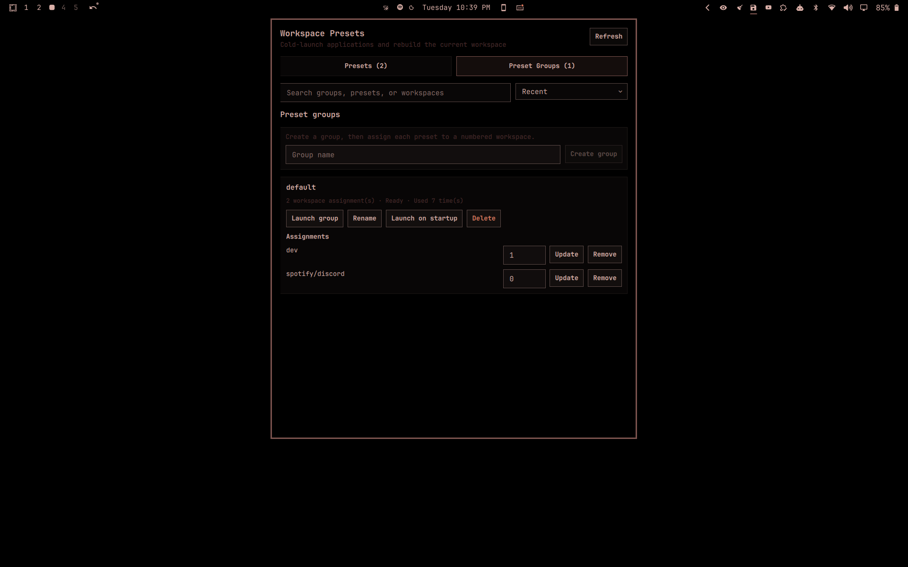

# Workspace Presets for Omarchy

Save the application windows on a Hyprland workspace as a named preset, then cold-load that preset later. Combine presets into groups assigned to numbered workspaces and launch a complete multi-workspace setup in one action—or automatically once when the Hyprland session starts. Workspace Presets launches missing applications, tracks the new windows, and rebuilds the saved layout instead of assuming the windows are already open.



This is a native Omarchy Quattro plugin: the bar widget and management panel run in `omarchy-shell`, while a bundled Python standard-library backend handles capture, validation, and restore orchestration.

## What it restores

- Application window count and identity
- Dwindle trees and split ratios
- Master orientation, master/stack membership, and master factor
- Scrolling columns, column membership, widths, and tape position
- Monocle ordering and final focus
- Floating/tiled state and floating geometry
- Window groups, member order, active member, and lock state
- Fullscreen/maximized, pseudotile, pinning, and static tags
- Duplicate windows with the same class, tracked as independent slots
- Omarchy shell panels discovered from their plugin manifests

## Limitations

Application-owned state is outside the compositor's control and is not restored. That includes browser tabs, open documents, unsaved editor buffers, and terminal processes. Apps may restore some of that themselves through their own session support.

## Requirements

- Omarchy 4.0 or newer
- Hyprland 0.56 or newer
- Python 3
- `uwsm-app` and `gtk-launch` (included in a normal Omarchy installation)

The panel reports a clear compatibility error instead of attempting a partial restore when these requirements are not met. Version 1 supports normal workspaces using Hyprland's built-in `dwindle`, `master`, `scrolling`, or `monocle` layouts.

## Install

```bash
omarchy plugin add https://github.com/blakestarling/omarchy-workspace-presets.git --enable
```

The plugin appears in the built-in bar. Left-click its workspace icon to open the preset manager; middle-click refreshes the list.

### Update

```bash
omarchy plugin update blakestarling.workspace-presets
```

### Disable

```bash
omarchy plugin disable blakestarling.workspace-presets
```

### Remove

```bash
omarchy plugin remove blakestarling.workspace-presets
```

Removing the plugin intentionally leaves presets in place. To delete that data too, first remove the plugin, then run:

```bash
rm -- ~/.config/omarchy-workspace-presets/presets.json ~/.config/omarchy-workspace-presets/presets.lock
```

If `XDG_CONFIG_HOME` is set, the data directory is `$XDG_CONFIG_HOME/omarchy-workspace-presets` instead.

## Use

### Save

1. Arrange the current workspace.
2. Open Workspace Presets from the bar.
3. Enter a unique name and choose **Save**.
4. If every window maps unambiguously to an installed desktop entry, the preset is immediately loadable.
5. Otherwise, choose **Set up** and select a suggested desktop entry, enter a `.desktop` ID, or provide a custom argv JSON array such as `["foot"]`.

A preset that needs launcher setup is saved as an explicit draft. It cannot be loaded until every window has a launch recipe. Installed Omarchy panel plugins are matched by their manifest name and relaunched through `omarchy-shell`; existing drafts are rechecked automatically when the service starts.

### Load

1. Choose **Load** on a ready preset.
2. If the current workspace is empty, loading starts immediately after validation. Matching windows on other workspaces are left untouched and new instances are launched.
3. Otherwise, review how many current windows will close. If matching windows exist on other workspaces, you can choose whether to launch new instances or move those existing windows. Nothing is moved silently.
4. Confirm the replacement.

Press **Escape** at any time to close the Workspace Presets panel and cancel a pending load confirmation.

Workspace Presets validates all launchers before closing anything. It then sends normal close requests to current-workspace applications and waits. If an application refuses to close—for example, because it is showing an unsaved-changes dialog—the restore stops and never force-kills it.

After the workspace is clear, the backend launches each saved slot through `uwsm-app`, waits for a newly created matching Hyprland stable ID, makes the windows temporarily floating, and rebuilds the saved layout deterministically. Groups and compositor state are restored last. A launch timeout is reported as a failure, never as a successful partial restore.

### Manage

- **Rename** changes the display name while preserving the preset's stable ID.
- **Overwrite** captures the current workspace into the selected preset after confirmation.
- **Delete** removes one preset after confirmation.
- **Refresh** reloads preset data from disk.

Preset names are trimmed, non-empty, and case-insensitively unique.

### Preset groups

1. Under **Preset groups**, enter a unique group name and choose **Create group**.
2. For each preset you want in the group, enter a number-row workspace key from **0 through 9** and choose **Assign**. As in Omarchy's default bindings, `0` targets workspace 10. A group allows one preset per workspace and one assignment per preset. Unsaved workspace edits remain in place while other assignments or group settings are updated.
3. Choose **Launch group**. The plugin validates every preset, launcher, and target workspace before it changes anything.
4. If all target workspaces are empty, launch begins immediately. Otherwise, one confirmation shows the total windows that will receive normal close requests.

Group loads launch new application instances instead of moving matches from unrelated workspaces. Workspaces are rebuilt one at a time as part of the single guarded operation, and focus returns to the workspace that was active when the group launch began. If a group or any target workspace changes after confirmation, the operation stops before closing anything.

Groups can be renamed, reassigned, and deleted without deleting their presets. A preset cannot be deleted while a group references it; remove that assignment first.

### Launch a group on startup

Choose **Launch on startup** on a complete group. Only one group can hold this setting, so enabling another transfers it. The plugin runs the selected group once when its service first starts in a new Hyprland session. A session-scoped guard prevents an `omarchy-shell` reload or plugin rescan from launching the group again. Enabling the setting does not immediately launch the group; it takes effect on the next Hyprland session.

Startup restore is intentionally equivalent to a confirmed group launch: assigned workspaces are replaced with normal close requests and applications are never force-killed. If a launcher or preset becomes invalid, startup restore reports the error rather than partially skipping it.

## Optional shell IPC

The widget exposes the standard Omarchy shell panel actions:

```bash
omarchy-shell shell toggle blakestarling.workspace-presets
omarchy-shell blakestarling.workspace-presets refresh
omarchy-shell blakestarling.workspace-presets save "Coding"
```

Starting a load over IPC still opens the panel for destructive confirmation:

```bash
omarchy-shell blakestarling.workspace-presets load PRESET_UUID
```

Group loads follow the same preflight and confirmation flow:

```bash
omarchy-shell blakestarling.workspace-presets loadGroup GROUP_UUID
```

## Data and security

Presets, preset groups, assignments, and the startup selection are stored as schema-versioned JSON at:

```text
${XDG_CONFIG_HOME:-~/.config}/omarchy-workspace-presets/presets.json
```

Writes use an advisory lock, a same-directory temporary file, `fsync`, and atomic replacement. The data and lock files are mode `0600`.

Desktop launchers store only the desktop entry ID, so application updates can change their underlying `Exec` line without making the preset stale. Custom launchers are stored as argv arrays and are never evaluated through a shell. Only configure a custom command you trust: it runs as your user when that preset loads.

## Troubleshooting

Check compatibility and inspect saved presets without loading anything:

```bash
python3 -B ~/.config/omarchy/plugins/blakestarling.workspace-presets/backend/main.py capabilities
python3 -B ~/.config/omarchy/plugins/blakestarling.workspace-presets/backend/main.py list
```

Validate the installed manifest:

```bash
omarchy plugin validate ~/.config/omarchy/plugins/blakestarling.workspace-presets
```

If the widget does not appear after enabling it:

```bash
omarchy-shell shell rescanPlugins
omarchy bar move blakestarling.workspace-presets --section left
```

Common restore failures:

- **Active workspace changed:** return to the workspace named in the confirmation and start the load again. Nothing is closed when this guard trips.
- **Desktop entry no longer exists:** open **Set up** and select the replacement entry.
- **No new window appeared:** the app may be single-instance or need a custom `--new-window` command. Retry and choose **Move existing**, or configure a custom argv launcher.
- **Application did not close:** respond to its save/discard dialog, then load again.
- **Startup group did not run after a shell reload:** this is intentional; startup groups run at most once per Hyprland session. Log out and back in to test the next-session behavior.
- **Preset is used by a group:** remove that preset's group assignment before deleting it.
- **Unsupported layout or special workspace:** switch the active normal workspace to one of the four supported built-in layouts before saving/loading.
- **Floating window moved after a monitor change:** exact pixels are used only when work-area size and scale match; otherwise geometry is normalized and clamped to the current monitor.

Hyprland 0.56 does not expose pseudotile state in its JSON client data. During capture the backend briefly forces pseudotile on and off, compares goal geometry, and immediately returns the window to its detected state. A state that produces no geometry difference is treated as visually equivalent.

## Development

Clone and validate:

```bash
git clone https://github.com/blakestarling/omarchy-workspace-presets.git
cd omarchy-workspace-presets
omarchy plugin validate .
PYTHONPATH=backend python3 -m unittest discover -s tests -v
python3 -m compileall -q backend
```

The backend's stdout is a newline-delimited JSON protocol. Commands emit `progress`, `result`, or structured `error` objects so the long-lived QML service never has to infer success from human-readable text.

See [CONTRIBUTING.md](CONTRIBUTING.md) for the live-workspace test matrix and release checklist.

## License

MIT © Blake Starling. See [LICENSE](LICENSE).
